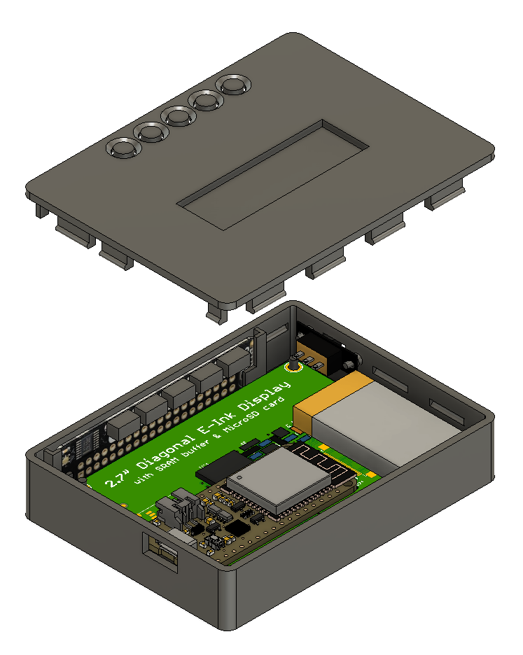

# Hello My Name Is ePaper Badge

## Parts List
The intention was to not need a custom PCB for this project.  While it could surely be consolidated and simplified, the building block nature makes it easier to see how the components interact and can be easily expanded or reused.

* [Adafruit #3405 - HUZZAH32 - ESP32 Feather Board](https://www.adafruit.com/product/3405)
* [Adafruit #4098 - 2.7" Tri-Color ePaper Display](https://www.adafruit.com/product/4098)
* [Adafruit #3582 - Pimoroni Button SHIM](https://www.adafruit.com/product/3582)
* [Adafruit #2750 - LiPo Battery 3.7v 350mAh](https://www.adafruit.com/product/2750)
* [Amazon - Micro Slide Switch](https://smile.amazon.com/gp/product/B08H59VFR1/)
* [Amazon - Magnetic Name Badge Holder](https://smile.amazon.com/gp/product/B07DJTPWP4/)

## Design Notes

The ePaper display has a resolution of 264x176 and is essentially two 1-bit displays layered atop one another.  Each byte can thus store 8 pixels and there are two buffers, one for black/white and one for red/white.  That means 264\*176\*2/8=11,616 bytes of RAM are required to hold the display buffer.

And ESP32 was chosen over a lower-powered chip for several reasons.  Having the frame buffer in native RAM makes it very easy to manipulate.  The higher clock speed means drawing operations don't take much time for even complex screens.  Onboard WiFi and BTLE give additional options for future expansion -- a customizer phone app, displays with live data, etc.

This particular ePaper module has an onboard SRAM that makes it usable with low memory devices.  It's not needed in the current project state, but it's definitely usable if memory becomes constrained.

There's also a MicroSD interface, which could allow for easily-updated image files, optional fonts, and icon sets.

With no special precautions beyond sleeping and polling for button presses every half second or so the battery should last at least a day or two.  Deeper sleep and using interrupts instead of polling could extend that significantly.  Startup is almost instant though, so only turning the device on when a display update is desired would save the most power.

The slide switch and magnetic badge holder are generic parts that can be swapped for whatever.  For the case as designed, the switch needs a 15mm mounting hole spacing and the body is 10 x 5 x 5mm.  The badge holder base plate is approximately 45 x 13mm and the case recess is just to make alignment easy.

## Wiring Diagram

The wiring diagram here represents the pins connected as they are currently laid out in the code.  Other pinouts are possible with adjustments.

## Case

A case suitable for 3D Printing is available in the [stl](stl) folder.  Editable STEP files are also provided.  It consists of two parts: a front case that all of the components mount to, and a back case that snaps in place.  Printing the back case scaled at 99% may help if it bows or is too tight to slide together without breaking the tabs.

Populated Case Example

Front Case

Back Case

