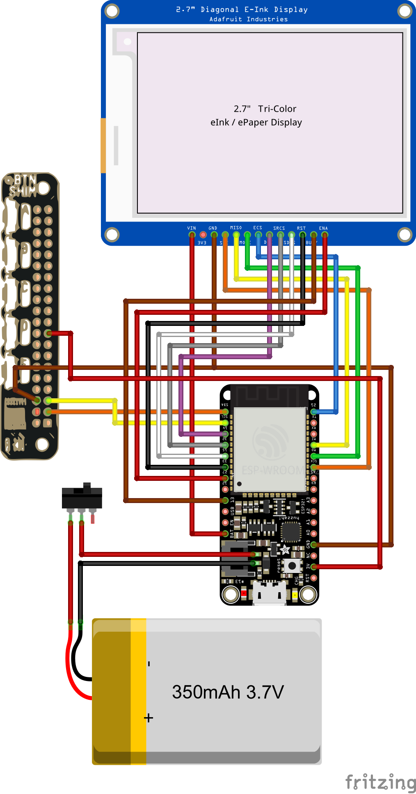

# Hello My Name Is ePaper Badge

## Parts List
The intention was to not need a custom PCB for this project.  While it could surely be consolidated and simplified, the building block nature makes it easier to see how the components interact and can be easily expanded or reused.

* [Adafruit #3405 - HUZZAH32 - ESP32 Feather Board](https://www.adafruit.com/product/3405)
* [Adafruit #4098 - 2.7" Tri-Color ePaper Display](https://www.adafruit.com/product/4098)
* [Adafruit #3582 - Pimoroni Button SHIM](https://www.adafruit.com/product/3582)
* [Adafruit #2750 - LiPo Battery 3.7v 350mAh](https://www.adafruit.com/product/2750)
* [Amazon - Micro Slide Switch](https://smile.amazon.com/gp/product/B08H59VFR1/)
* [Amazon - Magnetic Name Badge Holder](https://smile.amazon.com/gp/product/B07DJTPWP4/)

## Design Notes

The ePaper display has a resolution of 264x176 and is essentially two 1-bit displays layered atop one another.  Each byte can thus store 8 pixels and there are two buffers, one for black/white and one for red/white.  That means 264\*176\*2/8=11,616 bytes of RAM are required to hold the display buffer.

And ESP32 was chosen over a lower-powered chip for several reasons.  Having the frame buffer in native RAM makes it very easy to manipulate.  The higher clock speed means drawing operations don't take much time for even complex screens.  Onboard WiFi and BTLE give additional options for future expansion -- a customizer phone app, displays with live data, etc.

This particular ePaper module has an onboard SRAM that makes it usable with low memory devices.  It's not needed in the current project state, but it's definitely usable if memory becomes constrained.

There's also a MicroSD interface, which could allow for easily-updated image files, optional fonts, and icon sets.

With no special precautions beyond sleeping and polling for button presses every half second or so the battery should last at least a day or two.  Deeper sleep and using interrupts instead of polling could extend that significantly.  Startup is almost instant though, so only turning the device on when a display update is desired would save the most power.

The slide switch and magnetic badge holder are generic parts that can be swapped for whatever.  For the case as designed, the switch needs a 15mm mounting hole spacing and the body is 10 x 5 x 5mm.  The badge holder base plate is approximately 45 x 13mm and the case recess is just to make alignment easy.

## Case

A case suitable for 3D Printing is available in the [stl](stl) folder.  Editable STEP files are also provided.

The case consists of two parts:

#### Front Case

The front case is designed to hold all of the components.  The plastic pin patterns are intentionally slightly larger than the component hole spacings to allow for a slight amount of tension during test fitting.  Once everything is tested out, the extra protruding length can be melted with a soldering iron to "heat stake" the parts to prevent vibration.

#### Back Case

The back case is designed to snap securely into the front case.  It features a recess for the badge holder base plate and print-in-place compliant button mechanisms.  This is designed with ~0.4mm nozzles (0.4-0.5 line width) and 0.2mm layer heights in mind, but will probably work beyond that range some.  Likewise, a material that can take some elongation before failure, such as PETG, will be more readily successful.

A detailed view of the compliant button shows how it was designed with a thin, long element supporting the button to prevent rotation and removal, but allowing enough flex to click the microswitches beneath.

## Assembly

#### Wiring Diagram

The wiring diagram here represents the pins connected as they are currently laid out in the code.  Other pinouts are possible with adjustments.  Wiring was done with two short lengths of ribbon cable (hence the sequential colors), keeping in mind the intended final layout shown below.

#### Component Layout

## Operation

The standard mode has up to 5 static pages assigned to the 5 buttons.  Mounted in the case as provided here, the **A** button is the one on the right when looking at the back case, then **B** through **E** proceeding left.  Turn the badge on, then press one of the buttons to display that image.  As written, the badge sleeps and checks for button input periodically, so holding the button for a slight amount of time may be required.

A secondary mode has been added that showcases some potential advanced capability.  To use these secondary modes, hold down a button while turning the badge on.  If the **A** button is held down during power on, a WiFi access point mode is started.  Connect to the access point using the following details (or whatever you configured in `include/hello_config.h`):
* SSID: HelloBadgeXXXX (where XXXX are the last 4 hex digits of the board's MAC address to allow several to coexist)
* Password: t0mat03s
* Mode: WPA2 PSK

In this WiFi mode, your device will be assigned the IP Address 192.168.4.2.  Open a web browser and navigate to http://192.168.4.1/ and an interface will appear.  Using this interface, you can upload an image, adjust thresholds, see a preview of the black/white and red/white layers, then send it to the device for display.  At the bottom is a choice of slots **B** through **E**.  Choosing one of these slots will store the final uploaded image to flash for future display.  Access these images by holding down the button corresponding to the slot while turning the power on.